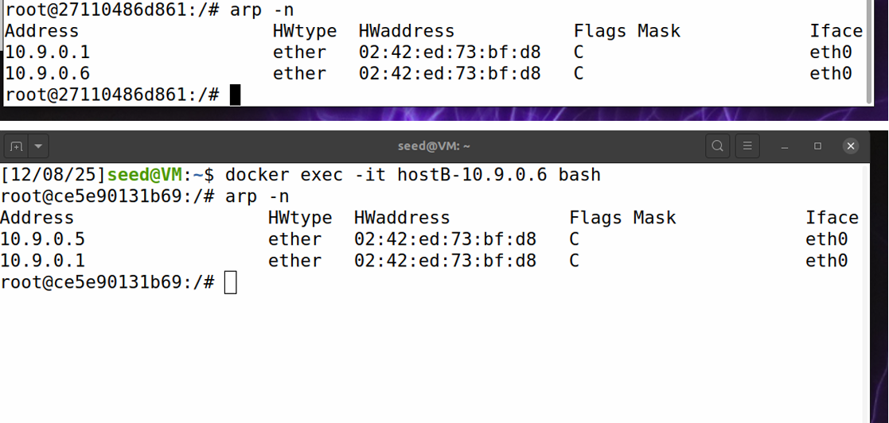
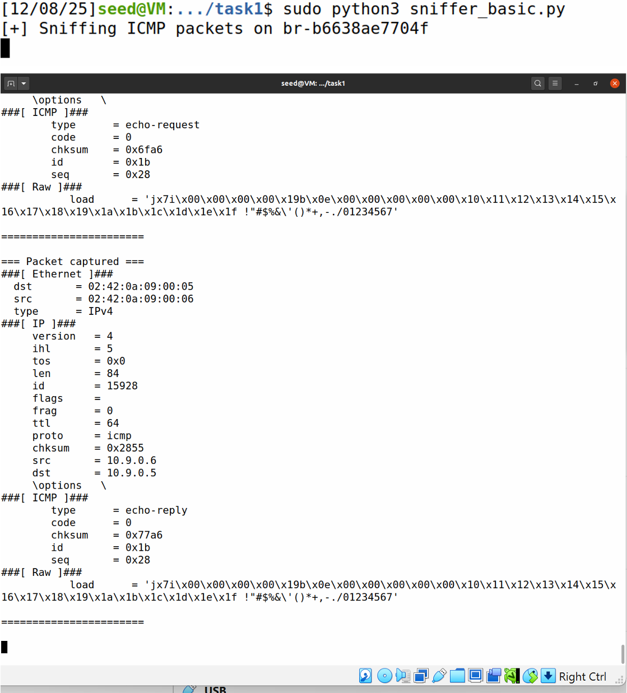
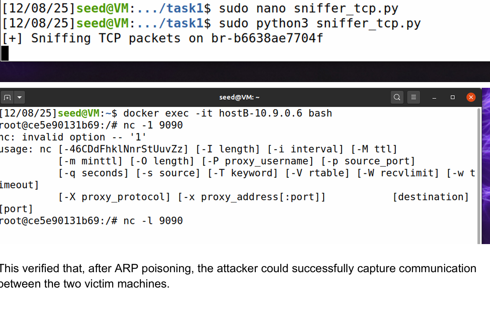

# Network Sniffing & ARP Spoofing Lab

This project demonstrates packet sniffing and ARP cache poisoning attacks in a controlled environment using SEED Labs.

## Overview
In this lab, I performed a man-in-the-middle (MITM) attack by exploiting the ARP protocol. By poisoning the ARP cache of two victim machines, I was able to intercept and analyze network traffic between them.

## Features
- ICMP packet sniffing
- TCP packet sniffing
- ARP cache poisoning attack
- Real-time packet analysis

## Tools Used
- Python (Scapy)
- Linux (SEED VM)
- Docker containers
- Networking protocols (ARP, TCP/IP)

## Key Concepts
- Man-in-the-Middle (MITM) attacks
- ARP cache poisoning
- Packet interception and analysis
- Network protocol vulnerabilities

## What I Learned
- How ARP spoofing enables traffic interception
- How attackers capture packets in real time
- Weaknesses in ARP protocol (no authentication)
- Importance of secure protocols (HTTPS, SSH)

## Sample Output

### ARP Spoofing Attack

### ICMP Packet Sniffing

### TCP Packet Sniffing

## Note
This project was performed in a controlled lab environment for educational purposes only.
